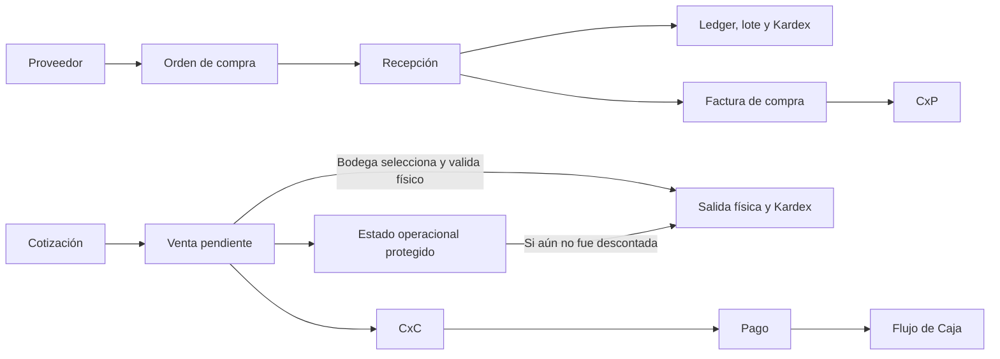

# Contexto maestro del ERP

**Propósito.** Memoria técnica y funcional para cambios futuros. Describe el código revisado y la evidencia disponible tras el cierre de PPP, valoración histórica, clasificación de snapshot legacy, FIFO multicapa, Cuentas Bancarias CRUD + Saldo Inicial, Reportería Integral y Certificación Integral E2E MASTER V1 (29-09-2026). No sustituye la verificación del flujo afectado antes de modificarlo. La [matriz final de Fase 3 y Post Fase 3](INFORME_E2E_MASTER_ERP.md) documenta la evidencia E2E: **REPORTERÍA INTEGRAL = GREEN**, **DESPACHO COMPLETO IDEMPOTENTE = GREEN**, **E2E MASTER = GREEN** (ciclo completo de negocio ejecutado y certificado). Baseline automatizado vigente: **565 passed / 0 failed**, dos suites aisladas consecutivas; delta de bases persistentes **0**.

## Cómo leer esta memoria

Para comportamiento implementado, comprobar el código actual; para comportamiento probado en navegador, usar el informe E2E más reciente; los informes anteriores explican decisiones e historia, pero sus conteos y semáforos pertenecen a la fecha de cada captura. Una suite verde no convierte en GREEN una función no probada. Cuando estas fuentes discrepen, investigar el caso y dejar constancia antes de asumir una regla. Las discrepancias conocidas se enumeran al final.

## Qué hace y cómo está construido

ERP de una bodega de productos de miel: maestros de productos, clientes y proveedores; cotizaciones, ventas, compras, recepciones, inventario/Kardex/lotes, recetas y órdenes de producción, ajustes, pagos, CxC, CxP, gastos, deudas, bancos, conciliación, Flujo de Caja, reportes y administración de usuarios/permisos.

| Capa | Implementación comprobada |
|---|---|
| Aplicación | Python y Flask 3; `app.py` registra blueprints, configura sesiones/CSRF y llama `init_db()` al importar. Despliegue definido con Gunicorn y Docker Compose. |
| Interfaz | Renderizado servidor Flask/Jinja2 en `templates/`, CSS en `static/css/`, JavaScript propio en `static/js/` y plantillas; hay Chart.js para gráficos. No hay framework SPA como base del proyecto. |
| Datos | PostgreSQL (Compose usa imagen 16); `core/database.py` gestiona conexiones y `db.py` mantiene la fachada de acceso. `repositories/` contiene consultas y escrituras, `services/` coordina reglas y flujos, `routes/` expone HTML/API. |
| Esquema | Migraciones SQL versionadas `migrations/*.up.sql`/`*.down.sql`, ejecutadas por `tools/migrate.py` y registradas en `schema_migrations`; `db.init_db()` también siembra catálogos mínimos. |
| Pruebas | `pytest` en `tests/unit`, `tests/integration`, `tests/security`; `tools/run_isolated_tests.py` ejecuta suites en clones efímeros. Playwright/Chrome se utilizó en recorridos E2E de navegador; no forma una suite permanente dentro del árbol de `tests/`. |
| Utilidades | `tools/reconcile_inventory.py` diagnostica inventario; `tools/` reúne auditorías y runner de tests. `docs/` e informes de raíz registran decisiones y verificaciones. |

El README describe una etapa anterior (base de datos y autenticación como “futuro”); **no describe la arquitectura vigente**. La separación ruta→servicio→repositorio es la orientación actual, aunque `db.py` y algunas rutas todavía contienen lógica heredada.

## Fuentes de verdad y modelo de inventario

`services/stock_context.py` define el balance operacional de lectura. Las reservas son **compromisos**, no existencias creadas:

| Magnitud | Definición vigente |
|---|---|
| `physical_stock` | Cantidad físicamente remanente. Con `requires_lot=true`: suma de `lot_stock.available_qty`; sin control de lote: suma de `inventory_movements.quantity`. |
| `reserved_stock` | Demanda comprometida completa, incluso si excede el físico. El contexto incluye ventas `Pendiente` aún no descontadas y materias primas de OT `Aprobada`. |
| `physical_reserved_stock` | `min(reserved_stock, max(physical_stock, 0))`: parte del compromiso cubierta físicamente. |
| `available_stock` global | `max(physical_stock - reserved_stock, 0)`: capacidad libre para **nuevas promesas**; nunca negativa. No asigna unidades a un pedido existente. |
| Físico asignable al pedido seleccionado | Físico remanente, evaluado bajo locks en la transición operacional. No se restan las reservas de otras ventas pendientes: todavía no son salidas ni asignaciones físicas. |
| Demanda no cubierta | `max(reserved_stock - max(physical_stock, 0), 0)`; se informa aparte y no es, por sí sola, una diferencia física. |

La identidad de una línea reservada se resuelve por `product_id`, después SKU exacto, nombre exacto y, sólo para legado, nombre parcial único. Una coincidencia ambigua se diagnostica como `RESERVA_AMBIGUA`; no se asigna arbitrariamente. `list_sales()` evita repetir una venta por múltiples pagos. Una venta pendiente que ya tiene `sale_items` (stock descontado) no se reserva por segunda vez.

**La igualdad físico = disponible global + reservado sólo vale si reservado ≤ físico.** En una venta sin stock puede haber físico 0, reservado 1, disponible global 0 y demanda no cubierta 1. **Reserva de demanda no equivale a asignación física de stock.** Para una nueva promesa se consulta el disponible global; para preparar un pedido existente se comprueba, bajo transacción, el físico remanente asignable a ese pedido. `get_product_available_stock()` en `repositories/inventory_repo.py` conserva un nombre histórico engañoso: devuelve el **físico sin descontar reservas**. Elegir explícitamente la magnitud que corresponda al flujo.

`inventory_movements` es el ledger cuantitativo y de procedencia; Kardex reconstruye saldos y costo en orden cronológico. `lots` guarda identidad/genealogía y `lot_stock` el remanente de cada lote. `consume_fifo_lots()` bloquea lotes y consume por `entry_date ASC, id ASC`. `lot_stock.available_qty` se reduce al consumir, no cuando se crea una reserva. `page_data.inventory_items` es un **snapshot legacy de compatibilidad y diagnóstico**, no fuente física operacional universal: ni debe tratarse su ausencia como cero ni eliminarse sin decidir sus escrituras/lecturas restantes.

Las validaciones transaccionales de producción en `repositories/production_repo.py` y `routes/produccion.py` aún requieren revisión específica de fuente física, lotes y locks; no extrapolar automáticamente la asignación de ventas a las OT. **El operador de bodega determina qué pedido se prepara primero**: no existe prioridad exclusiva por fecha ni ID de venta. La disponibilidad global de pantalla incluye toda la demanda pendiente, incluso la no cubierta. Ejemplo: físico 10, venta A pendiente por 8 y venta B pendiente por 5 dan reservado global 13, disponible global 0 y demanda no cubierta 3. Si bodega prepara B primero, consume 5 y A queda bloqueada por faltante 3; si prepara A primero, consume 8 y B queda bloqueada por faltante 3.

### PPP y valoración

`repositories/kardex_repo.py:get_current_ppp()` recorre `inventory_movements` por fecha e ID: una entrada valoriza cantidad y modifica el promedio; una salida se valora con el PPP vigente y reduce cantidad/valor. Sin movimientos, usa `products.cost` como fallback. Este campo maestro no sustituye el PPP calculado; el E2E base mostró `products.cost=0` y PPP efectivo CLP 1.000. El costo congelado de una venta se conserva en `sale_items.unit_cost_at_sale`. Cantidad y valoración son controles distintos: ledger y lotes pueden cuadrar mientras un `unit_cost` histórico es incorrecto.

El ERP combina columnas monetarias `NUMERIC` (por ejemplo deudas) con columnas heredadas `DOUBLE PRECISION` (por ejemplo `sales.total_amount`, `inventory_movements.unit_cost`) y conversiones a `float` en algunos repositorios. No asumir que **toda** la base usa Decimal/NUMERIC; preservar la semántica actual y evaluar precisión por flujo antes de cambiar tipos.

## Flujos operacionales

### Compras y recepción

Una OC confirma proveedor, líneas, cantidades, costos y condiciones; **crear la OC no incrementa stock**. La recepción oficial (`register_inventory_entry`) guarda cabecera/líneas, incrementa `lot_stock` cuando corresponde y registra `PURCHASE_RECEIPT` con costo de la recepción y referencia a la OC. Esa entrada crea stock y alimenta el PPP. La factura de compra genera la obligación financiera y aparece en CxP; una recepción/OC no debe duplicar la obligación. Conservar líneas, factura, movimientos y referencias para trazabilidad histórica. El E2E base documenta OC 4077, recepción 2469, +100 a CLP 1.000 y factura 3669 por CLP 119.000.

### Cotizaciones y ventas

Las cotizaciones se guardan en `sales` distinguidas por folio/estado; pueden estar Activa, Ganada o Perdida. **Perdida fija probabilidad 0%; conversión Ganada fija 100%** y crea una venta conservando la cotización. La cotización por sí misma no descuenta inventario. Dirección de despacho y categoría de cliente se capturan como snapshot documental: una cotización emitida no debe cambiar si se edita el maestro del cliente.

**La falta de disponible global no impide crear la venta.** La conversión oficial crea una venta `Pendiente` sin asignar ni descontar físico, aunque haya existencias. En una venta todavía no descontada, la primera transición a `En Preparación`, `Para Despacho` o `Completada` bloquea venta y productos, comprueba el físico remanente y aplica una sola salida dentro de la transacción. Las reservas de otras pendientes no bloquean esa elección; el consumo ya ejecutado sí reduce el físico para el siguiente pedido. Si el físico no alcanza, la venta continúa Pendiente. `sale_items` marca la salida realizada y evita el doble descuento. Completada exige factura/boleta adjunta según la ruta actual. Registrar o aprobar un pago no debe elegir automáticamente qué venta consume stock; el estado financiero y el operacional son hechos separados. El recorrido de todos los estados con stock y sus reintentos fue comprobado; el gate integral de despacho sigue RED por reapertura de ventas canceladas con salida ya revertida (véase el cierre de despacho al final).

La venta Pendiente sin físico suficiente mantiene su demanda reservada visible y no puede avanzar a ejecución física. El embalaje se valida contra el físico remanente bajo lock cuando se asigna al despacho; las reservas comerciales pendientes de cajas tampoco son asignación física exclusiva. No confundir `payment_status` con estado de despacho: un pago y una salida de inventario son hechos distintos. La idempotencia esperada es una sola salida por venta aunque se repita la transición.

### Lotes, FIFO y producción

Una recepción loteada crea `lots`/`lot_stock` junto al movimiento. La salida FIFO consume lotes con orden estable y deja genealogía. Fase 3 observó consumo A→B, pero **no validó el consumo/costo entre capas de distinto valor**; FIFO completo sigue RED. El stock de producto con lote se lee de `lot_stock`; el ledger se contrasta separadamente, no se toma el máximo de ambas fuentes.

**Validación aislada posterior, 28-09-2026:** FIFO físico y valoración contable son reglas distintas. `consume_fifo_lots()` selecciona por `entry_date ASC, id ASC`, bloquea filas con `FOR UPDATE`, verifica la suma antes de descontar y devuelve el reparto para que la producción registre genealogía y movimientos en la misma transacción. `PRODUCTION_INPUT` normal utiliza **PPP vigente**, no costo específico de la capa. Con A=10 a 1.000 y B=10 a 1.200, consumir 15 deja A=0/B=5, captura PPP 1.100 en ambos inputs, transfiere 16.500 al output de 15 y deja PPP terminado 1.100. Reintento, empate de fechas, rollback tras fallo en segundo insumo y concurrencia quedaron cubiertos en `test_fifo_multilayer_production.py`. La ruta administrativa ahora muestra rechazo controlado tras rollback por insuficiencia; antes podía devolver 500.

**Alcance pendiente de revaluaciones negativas:** la finalización móvil usa costo efectivo revaluado de inputs, mientras Kardex valoriza las salidas siempre al PPP cronológico. Una revaluación directa de `PRODUCTION_INPUT` puede hacer divergir costo transferido y salida reconstruida. La prueba aislada obtuvo output 17.500 al revaluar 10 unidades de input desde 1.100 a 1.200; la política PPP de Kardex reconstruye 16.500. Falta decidir si se limitan revaluaciones de salidas y se corrige desde su origen, o si se define un ajuste contable explícito para costo efectivo de salida. **No cambiar silenciosamente la política ni extrapolar el cierre de #56163 (entrada) a todas las salidas revaluadas.**

El gate FIFO sigue **RED**: falta el E2E persistente y resolver el alcance anterior. Las recepciones oficiales y la finalización administrativa escriben automáticamente `page_data.inventory_items`; no es posible ejecutar esos flujos y prometer snapshot absolutamente intacto sin una decisión adicional. Se solicitó permitir sólo esas escrituras inherentes; aún no se ejecutó el E2E ni se modificó `facturacion`. La validación posterior fue **78 tests dirigidos y dos suites de 527/0**, con conteos/huellas idénticos en las 54 tablas de cada base persistente y clones eliminados. CHECK de `facturacion`: integridad operacional OK; advertencias legacy aisladas.

Las recetas definen producto terminado e insumos. La OT pasa por planificación/solicitud, aprobación, consumo y finalización según la ruta utilizada. El flujo bloquea ejecución sin materias primas; la OT aprobada compromete insumos. El consumo registra `PRODUCTION_INPUT` negativo, lotes consumidos y costo del insumo; la terminación registra `PRODUCTION_OUTPUT` positivo, lote de salida si aplica, estado final y costo unitario derivado de los consumos. La ruta de Operario móvil fue corregida en Fase 3 para guardar el costo calculado en movimiento y OT; la nueva OT 6093 salió a CLP 1.066,6667. Repetir finalización no debe producir otro ingreso.

La antigua salida **#56163 de OT6092** (que había quedado a costo 0 por la ruta móvil anterior) fue remediada mediante el mecanismo inmutable `inventory_cost_revaluations` (migración 000024):
- Movimiento #56163 en `inventory_movements` permanece intacto e inmutable (`quantity=3.0, unit_cost=0.0`).
- La revaluación oficial registra `old_unit_cost = 0.000000`, `new_unit_cost = 1000.000000`, `difference_unit_cost = 1000.000000`, `total_value_difference = 3000.000000`, `reason = "Corrección de valoración histórica OT6092 por costo 0 generado por la antigua ruta de finalización de Operario móvil."`, `reference_doc = "OT6092"`, `created_by = "Administrador"`.
- Los saldos físicos y lotes no sufren ninguna alteración.
- El costo efectivo de #56163 es CLP 1.000,00.
- El PPP de `PRD001` quedó cerrado y recalculado limpiamente en **CLP 1.016,6667** (en lugar de CLP 266,6667), reflejando con exactitud los insumos consumidos (3 un a CLP 1.000 de OT6092 + 1 un a CLP 1.066,6667 de OT6093 = 4 un valorizadas en CLP 4.066,6667).
- `get_current_ppp()`, `get_product_kardex_history()` y `OperarioService.finalize_production()` aplican de forma universal y transparente el costo efectivo revaluado.

### Ajustes de inventario

La solicitud `inventory_adjustment_requests` en `PENDING` guarda conteo/snapshot y **no modifica stock**. La aprobación autorizada valida estado, snapshot y movimientos posteriores, bloquea filas, registra un único movimiento y auditoría; el reintento no aplica de nuevo. El solicitante no aprueba su propia solicitud. El flujo actual bloquea ajustes positivos por costo contable no definido y aprobación de producto loteado sin política de lote; no inventar valoración o genealogía. La vista de ajuste aprobado se corrigió para mostrar el saldo ya aplicado, sin sumar otra vez la diferencia.

## Finanzas y documentos relacionados

### CxC y pagos de venta

`sale_payments` mantiene encabezado/estado financiero; `sale_payment_items` registra pagos parciales individuales, medio, fecha, cuenta y evidencia cuando corresponde. El flujo de pago bloquea la venta, valida saldo, usa clave de idempotencia, registra historial y marca Pagado sólo cuando el acumulado cubre el total. Transferencia requiere cuenta activa y comprobante; efectivo no exige ambos. CxC distingue total, pagado y saldo y conserva el histórico aunque cierre la obligación. `collection_actions` registra llamadas/compromisos/seguimiento: **un compromiso de pago no reduce saldo**. Sólo el pago real aprobado lo reduce.

### CxP, gastos y deudas

CxP operacional resume obligaciones de `purchase_invoices`; la vista financiera incorpora las fuentes de gastos materializados aplicables. El reporte histórico “Facturas de compra y gastos” reúne documentos para análisis, pero no equivale automáticamente a saldo pendiente de CxP. Los KPIs de saldo usan el universo filtrado completo, no la página visible.

`operational_expenses` es la regla maestra de gasto; `operational_expense_occurrences` representa una ocurrencia persistida. Una regla activa puede proyectar vencimientos futuros en Flujo de Caja sin insertar filas. El consolidado evita duplicar regla y ocurrencia de misma fecha y da prioridad a la ocurrencia persistida. **No se identificó mecanismo oficial de materialización automática/manual del maestro recurrente hacia CxP: NO IMPLEMENTADO.** No registrar una proyección como pago u obligación ya materializada.

Una deuda (`debts`) genera cuotas (`debt_installments`); un pago parcial crea `debt_payments`, reduce el saldo de la cuota y se audita. Se rechaza sobrepago bajo bloqueo de la cuota. Deuda, cuota, pago y movimiento bancario son entidades distintas. Las cuotas pendientes se proyectan y los pagos efectivos se reflejan según sus fuentes en Flujo de Caja.

### Bancos, conciliación y Flujo de Caja

`bank_accounts` cataloga cuentas. Una cartola XLSX pasa por upload→validación/preview→confirmación; la huella del movimiento y la importación impiden duplicados. `bank_transactions` conserva el hecho bancario. Conciliar enlaza ese hecho con una operación ERP existente; **no crea otro `sale_payment_item` ni otro pago**. Desconciliar deshace el vínculo, conserva el pago y registra `RECONCILED`/`UNRECONCILED` en auditoría. La Fase 3 vinculó un abono de CLP 7.500 al payment item 2200 y lo desvinculó/reconcilió por UI.

`repositories/cash_flow_repo.py` consolida saldos bancarios iniciales, cobros reales aprobados, ingresos proyectados de CxC, pagos/pendientes de facturas de compra, ocurrencias de gastos, cuotas y pagos de deuda, reglas recurrentes futuras y movimientos bancarios no conciliados. Una conciliación debe evitar contar dos veces el banco y el pago ERP; una obligación parcialmente pagada proyecta sólo el saldo. Las transferencias internas afectan cuentas individuales y netean cero en el consolidado. El detalle de pantalla se limita a 30, pero el motor conserva la lista completa para KPIs/exportación; **todavía hace un slice Python**, por lo que no es paginación SQL real de este listado.

## Reportería, rendimiento y UX

Separar documentos históricos, obligaciones abiertas CxC/CxP, proyección de Flujo de Caja y Kardex/valoración: cada reporte tiene fuente y tiempo contable distintos. Los Excel deben exportar el universo filtrado completo, salvo función explícita de exportar página. Fase 3 cotejó algunos XLSX filtrados de Facturas/Gastos, CxP y Flujo de Caja; reportería integral permanece RED.

`core/pagination.py` fija `PAGE_SIZE=30`, normaliza páginas y conserva parámetros URL. Hay listados con `COUNT` y `LIMIT/OFFSET` SQL y pruebas de 0/1/30/31/60/61 registros. Esto **no certifica la optimización transversal**: la auditoría de 44 unidades dejó P0/P1 pendientes; inventario, Kardex, reportes financieros y Flujo de Caja contienen cargas completas o recortes posteriores a la consulta. Kardex reconstruye PPP cronológicamente, de modo que limitar movimientos antes del cálculo cambiaría resultados. Medir cada consulta y separar agregado/valoración de detalle antes de paginar; no usar el tamaño pequeño actual de `facturacion` como prueba de escalabilidad.

La interfaz usa SSR/Jinja, CSS y JavaScript vanilla. Conservar un diseño sobrio, claro y operacional: formularios con validación visible, botones con estado, tablas utilizables, navegación reproducible y mensajes de error. No introducir un framework frontend pesado sin decisión arquitectónica. Una ruta HTTP 200 por sí sola no demuestra que un formulario o botón funcione.

## Seguridad, transacciones y pruebas

`app.py` habilita sesiones con cookie HttpOnly/SameSite, protección CSRF global y manejo de 403/404/500; `security.py` y decoradores/rutas aplican autenticación y RBAC. Las validaciones críticas deben ejecutarse también en backend. Hay relaciones FK, referencias polimórficas de movimientos y escrituras agrupadas en transacciones; algunos flujos usan `FOR UPDATE` e índices/llaves de idempotencia. No deshabilitar restricciones para resolver un E2E.

**Bases:** desarrollo normal `facturacion`; plantilla persistente de tests `facturacion_cleanup_verify`; cada suite se ejecuta en `facturacion_test_run_<12 hex>` creada desde la plantilla y eliminada al terminar. El guard de `core/test_database_guard.py` exige `APP_ENV=testing`, `ERP_TEST_MODE=1`, URLs coincidentes, nombre/host/puerto coincidentes y un comentario marcador en PostgreSQL; falla cerrado. `pytest.ini` carga `core.test_db_pytest_plugin`. El aislamiento es por base efímera, no rollback obligatorio por test: concurrencia y commits reales siguen pudiendo probarse. El runner compara conteos de ambas bases persistentes. Baseline Fase 3: **505 passed / 0 failed** dos veces. La corrección posterior de prioridad cronológica quedó sustituida por la selección operacional del pedido; la validación de esta regla obtuvo **510 passed / 0 failed en dos suites completas**. Delta de `facturacion` y plantilla **0** en ambas pasadas. Un E2E deliberado en `facturacion` deja pocos documentos trazables; pytest no debe crearlos allí.

## Reconciliador y estado actual

`tools/reconcile_inventory.py --check --json` separa con rigor arquitectónico:
1. **Integridad operacional** (`operational_integrity: "OK" | "REQUIRES_REVIEW"`): evalúa únicamente fuentes vivas (`ledger_vs_lots`, `reserva_inconsistente`, `sin_movimientos_con_stock`, `movimientos_sin_origen`, `referencias_huerfanas`, `referencias_no_verificables`).
2. **Estado de advertencias legacy** (`legacy_status: "OK" | "LEGACY_WARNING"`): aísla desincronizaciones de `page_data.inventory_items` (`snapshot_vs_ledger`, `snapshot_vs_lotes`, `snapshot_ausente`, `snapshot_valor_ausente`).

Diagnóstico verificado tras la revaluación de #56163:
- **70 productos analizados**.
- **Integridad operacional: OK** (ledger_vs_lots: 0, reservas inconsistentes: 0, referencias huérfanas: 0, 11/11 movimientos con referencia válida).
- **Demanda no cubierta**: 1 producto / 1 unidad (venta legítima sin stock).
- **Estado advertencias legacy: LEGACY_WARNING** (4 productos: 2 con snapshot ausente por ser creados con posterioridad al snapshot legacy, y 2 con snapshot divergente por movimientos operacionales no sincronizados a page_data).
- **Investigación de los 2 productos con snapshot divergente (delta 8)**:
  1. `PRD001` (ID 1): snapshot 0, ledger 4, lotes 4 (delta 4 unidades producidas en OT6092 y OT6093).
  2. `PT-CLA-001` (ID 60): snapshot 94, ledger 90, lotes 90 (delta 4 unidades: recepción inicial de 100 menos 10 unidades vendidas en venta 14253 vs snapshot antiguo de 94).

La matriz final consolidada distingue:

| Estado | Áreas |
|---|---|
| GREEN con evidencia acotada | Login/sesión, RBAC/CSRF, Dashboard, CRUD de productos/clientes/proveedores, importación de productos, compras/recepciones, Kardex/referencias, producción nueva valorizada, **revaluación histórica inmutable / PPP cerrado (PRD001 @ 1.016,6667)**, ajustes, cotizaciones, venta sin stock, pagos, CxC/cobranza, CxP de factura, gastos proyectados en Flujo de Caja, deudas, conciliación, paginación funcional, auditoría, **reconciliador (integridad operacional OK)** e aislamiento/tests. |
| RED | FIFO entre lotes de distinto costo, despacho por todos los estados con stock, cuentas bancarias CRUD/saldo inicial y reportería integral. **E2E MASTER = RED.** |
| NO IMPLEMENTADO | Materialización identificable de una regla maestra recurrente como ocurrencia/obligación CxP. |
| DEPRECADO / AVISO LEGACY | `page_data.inventory_items` clasificado formalmente como snapshot legacy desconectado. |

## Bugs corregidos que no deben reaparecer

| Problema confirmado | Causa y corrección | Regresión/evidencia |
|---|---|---|
| Venta ya descontada aparecía otra vez como reserva | `StockContext` excluye ventas pendientes con `sale_items` materializados. | `test_already_discounted_pending_sale_is_not_reserved_twice`; E2E base. |
| Venta sin stock no distinguía demanda de reserva cubierta | Se separaron `reserved_stock`, `physical_reserved_stock` y demanda no cubierta sin fabricar stock. | Tests de semántica de stock/reconciliador; E2E Master Fase 1. |
| Interpretación anterior, **sustituida**: venta más antigua retenía físico para sí | Se había restado demanda de ventas pendientes anteriores al validar otra venta y se podía descontar durante la conversión de cotización. El dueño funcional confirmó que era una asignación cronológica indebida; se retiró sin borrar esta historia. | Sustituida por `test_operator_selects_which_pending_sale_uses_physical_stock` y `test_quotation_conversion_does_not_allocate_stock`. |
| Interpretación anterior, **sustituida**: cajas pendientes quedaban físicamente apartadas | Se restaban reservas comerciales al registrar embalaje. Ahora el despacho elegido valida físico bajo lock; otra venta pendiente no posee esas cajas en exclusiva. | `test_packaging_allocation_is_not_blocked_by_pending_demand`. |
| Pago completo podía decidir una salida física antes de la preparación | Se separó la aprobación financiera de la asignación de bodega: una venta no descontada sigue Pendiente aunque quede Pagada. | `test_full_payment_does_not_choose_a_sale_for_preparation`. |
| Finalizar OT sin saldo FIFO podía devolver HTTP 500 | La transacción ya revertía los efectos; faltaba capturar el error de dominio al salir de ella. Ahora se muestra rechazo controlado después del rollback. | `test_insufficient_fifo_and_production_leave_no_partial_effects`, rollback del segundo insumo y concurrencia en `test_fifo_multilayer_production.py`. |
| Cotización Perdida/probabilidad y JavaScript de alta | Pérdida fuerza 0%; se retiró llave JS extra; Ganada convertida fija 100%. | Tests de cotización y recorrido Playwright; informe E2E Master. |
| Ajuste aprobado mostraba saldo como si se aplicara otra vez | Vista ahora usa saldo actual tras resolver la solicitud; aprobación única protegida. | Test de ajuste y reintento UI #214. |
| Alta de deuda con cuenta opcional vacía devolvía 500 | Ruta dejó de convertir `""` directamente a entero. | Regresión de deuda; deuda #235 E2E. |
| Modales de cuota/cobranza no enviaban fecha visible | Sincronización mediante API de Flatpickr (`setDate`/`clear`). | Retest de pagos y cobranza en navegador. |
| Dashboard omitía ventas `P-` en KPI de pendientes | Métrica usa mismo universo `VTA-`/`P-` que el listado. | Test de métricas/paginación; UI/API mostraron pendiente 1. |
| Producción móvil creaba salida a costo cero | Finalización calcula costo desde consumos valorizados y lo guarda en movimiento/OT. | Test de Operario; OT6093 valorizada. **No reparó salida histórica #56163.** |
| Gasto recurrente activo no aparecía en flujo futuro | Consolidado agrega proyección de maestro y deduplica contra ocurrencia persistida, sin materializarla. | Test de Flujo de Caja 9/9; UI/XLSX CLP 1.250 una vez. |

## Deuda técnica conocida y discrepancias

Las prioridades indican impacto en el objetivo actual, no una orden de modificar datos sin diagnóstico:

| Prioridad | Trabajo pendiente demostrado |
|---|---|
| P0 | Definir corrección auditable de `PRODUCTION_OUTPUT` #56163/OT6092 a costo 0 y efecto sobre PPP; resolver semántica/escrituras del snapshot legacy sin cambiar la fuente física; completar prueba FIFO entre capas de distinto costo y venta con stock a través de todos los estados/idempotencia; definir y probar por separado la asignación transaccional de insumos a producción con fuente de lotes y locks correctos; cerrar los listados grandes ya clasificados P0 con paginación SQL real y equivalencia de KPIs/Excel, especialmente Flujo de Caja/Kardex. |
| P1 | Verificar segundo candidato snapshot del reconciliador; probar cuentas bancarias CRUD/saldo inicial y reportería completa; definir materialización de gasto recurrente hacia CxP si el negocio la requiere. |
| P2 | Actualizar README y nombres legacy engañosos cuando se pueda hacer sin cambiar contratos; revisar precisión monetaria heterogénea (`DOUBLE PRECISION`/`NUMERIC`) y necesidades de stock por bodega/ajustes positivos o loteados. |

**Contradicciones/alcances que requieren investigación, no corrección documental automática:**

1. `README.md` anuncia PostgreSQL/autenticación como futuro; `app.py`, migraciones, seguridad y E2E prueban que existen.
2. El docstring de `_convert_quotation_to_sale()` aún dice que falta de stock impide generar venta; el cuerpo crea una venta Pendiente sin descuento y el E2E lo comprobó. Mensajes de error asociados también conservan texto antiguo.
3. La interpretación cronológica registrada en el hito anterior fue reemplazada por decisión funcional: reservado global mide demanda, no asignación. Un pedido elegido por bodega se valida contra físico remanente bajo locks; el disponible global puede ser cero y aun así prepararse uno de varios pedidos pendientes. Quedan por revisar por separado líneas legacy sin `product_id` y validaciones de producción.
4. La normalización antigua expresaba `físico = disponible + reservado`; la regla actual permite reserva mayor que físico. En ese caso la igualdad no aplica y se informa demanda no cubierta.
5. Fase 3 marca paginación **funcional** GREEN, mientras la auditoría de rendimiento mantiene P0/P1 RED y `cash_flow_repo.paginate_movements()` sigue recortando una lista completa en Python.
6. El informe Fase 3 reporta dos candidatos snapshot con delta absoluto 8; sólo identifica explícitamente PRD001. No atribuir el otro caso sin consulta de detalle.
7. Informes previos contienen baselines 434/455/485/501/505 y volúmenes masivos anteriores a la limpieza. Son históricos; el baseline automatizado más reciente es 508/0 en una suite completa, y los conteos viejos no describen la base actual.

## Reglas obligatorias para agentes IA

1. Leer este documento y la regla de negocio afectada antes de editar; comprobar código y evidencia E2E vigente.
2. No modificar stock, movimientos, pagos, lotes ni PPP directamente por SQL para superar una prueba o esconder una diferencia.
3. No borrar historia ni recalcular valoración sin estrategia aprobada, transaccional, auditable y con reversa.
4. No cambiar reglas de negocio ni debilitar asserts para obtener tests verdes. Una corrección funcional debe tener regresión cuando corresponda.
5. Crear datos E2E por rutas, formularios, servicios o endpoints oficiales; usar SQL en `facturacion` principalmente para lectura/diagnóstico, salvo operación administrativa explícita y auditada.
6. Mantener FK, transacciones, permisos, CSRF y comprobaciones backend. Un control frontend nunca es la única barrera.
7. Ejecutar pytest con el runner aislado; jamás dirigir tests escritores a `facturacion` ni a la plantilla persistente.
8. Respetar fuentes de stock, semántica de reserva y distinción entre documentos/proyecciones/pagos. El disponible global **informa** la capacidad libre para nuevas promesas, pero no prohíbe crear una venta sin stock; la venta ya pendiente elegida por bodega se ejecuta sólo si el físico remanente alcanza bajo locks, sin prioridad por fecha/ID ni por otras reservas pendientes. No sumar reservas al físico ni duplicar cobros al conciliar.
9. Para listados grandes, filtrar/ordenar/limitar en PostgreSQL y conservar KPIs/Excel sobre todo el universo. No confundir 30 filas HTML con paginación servidor.
10. Si código, informe y este contexto discrepan: detener la suposición, investigar y documentar. Actualizar este documento cuando cambie una decisión arquitectónica o regla importante.
11. No declarar GREEN por HTTP 200 ni por suite verde: exigir evidencia del flujo, datos, estados, integridad y límites aplicables.

## Historial de hitos

| Hito | Resultado que importa hoy |
|---|---|
| Limpieza controlada de base de desarrollo | Se conservaron maestros útiles, se retiró historia artificial y se estableció inventario limpio; no repetir limpieza para pruebas ordinarias. |
| Reconciliador V2 y normalización de stock | Snapshot ausente separado de stock cero; fuente física lote/ledger, reservas completas y disponible no negativo. |
| Aislamiento de tests | Plantilla persistente y clones efímeros con guard fail-closed; delta de bases persistentes 0. |
| E2E base limpia | Compra→recepción→PPP→cotización→venta→pagos/CxC/CxP/Flujo de Caja; corrigió doble reserva. |
| E2E Master Fases 1 y 2 | Venta sin stock, deuda, ajustes, cobranza, importación bancaria y otros flujos; cierre parcial. |
| E2E Master Fase 3 | Producción nueva valorizada, importación de productos, conciliación real, proyección recurrente y KPI Dashboard; quedaron gates RED documentados. |
| Interpretación cronológica posteriormente sustituida | Se había dado prioridad física a ventas pendientes antiguas y a sus reservas de embalaje. Las suites históricas fueron **2 × 507** y luego **508 passed / 0 failed**; esos tests se actualizaron al confirmar la regla de selección operacional. |
| Selección operacional de pedidos | Bodega decide qué venta Pendiente preparar; se comprueba físico remanente con locks, mientras el reservado global conserva toda la demanda. Conversión y pago no asignan físico. |
| Validación aislada FIFO multicapa | 9 casos nuevos, 78 dirigidos GREEN y dos suites de 527/0; delta de ambas bases persistentes 0. FIFO físico/PPP normal verificados; gate RED hasta completar E2E y decidir alcance de revaluaciones negativas. |
| Cierre FIFO multicapa y regla oficial de valoración | Regla oficial fijada: FIFO físico + PPP contable de salidas. Bloqueo de revaluaciones directas de salidas en repo; E2E persistente en `facturacion` completado por flujos oficiales (Lote A 10@1000, Lote B 10@1200, OT por 15, insumo 5 remanente PPP 1100, PT15 PPP 1100). Reconciliador operational_integrity=OK. Suites aisladas 2 × 527 passed / 0 failed, delta persistente 0. FIFO = GREEN; E2E MASTER permanece RED. |

### Documentos de apoyo revisados

[E2E Master Fase 3](INFORME_E2E_MASTER_ERP.md), [E2E base](INFORME_E2E_BASE_LIMPIA.md), [limpieza de desarrollo](INFORME_LIMPIEZA_SIMPLE_DESARROLLO.md), [normalización de stock](INFORME_NORMALIZACION_MODELO_STOCK.md), [reconciliador V2](INFORME_RECONCILIACION_INVENTARIO_V2.md), [auditoría forense](INFORME_AUDITORIA_FORENSE_INVENTARIO.md), [auditoría PPP](INFORME_AUDITORIA_PPP.md), [ledger vs lotes](INFORME_LEDGER_VS_LOTES.md), [aislamiento de tests](INFORME_AISLAMIENTO_BASE_TESTS.md), [auditoría de paginación](AUDITORIA_PAGINACION_ERP.md), [optimización de listados](INFORME_OPTIMIZACION_LISTADOS_ERP.md), [ajustes](docs/INVENTORY_ADJUSTMENT_WORKFLOW.md), [pagos de venta](docs/SALE_PAYMENT_WORKFLOW_REPORT.md), [clientes/cotizaciones](docs/CLIENT_QUOTATION_CUSTOMER_DATA_REPORT.md) y [gastos](docs/OPERATIONAL_EXPENSES_WORKFLOW.md). Las reglas críticas se contrastaron además con los archivos de rutas, servicios, repositorios, migraciones, seguridad y runner de tests citados arriba.

## Cierre controlado de despacho — evidencia vigente 29-09-2026

Este apartado complementa y prevalece sobre las menciones anteriores de despacho «pendiente de probar». El E2E persistente ya se ejecutó: 9 ventas E2E-DISPATCH, sus 9 cotizaciones, 3 OC y 3 recepciones, sin limpieza ni SQL de negocio manual. Evidencia completa en el apartado POST FASE 3 — CIERRE CONTROLADO DE DESPACHO de [INFORME_E2E_MASTER_ERP.md](INFORME_E2E_MASTER_ERP.md).

- Preparación, Para Despacho y Completada materializan una vez; venta 14265 recorrió todos los estados y reintentos con un único SALE 56178. La materialización loteada puede generar varias filas, una por capa: venta 14267 consumió 4+2 y todas las salidas se valorizaron al PPP 1120.
- La venta se bloquea mediante FOR UPDATE **antes** de consultar sale_items; producto/lotes se bloquean y todo se confirma en la misma transacción. Prueba nueva observa pg_blocking_pids para cerrar la ventana CHECK→INSERT. No hay UNIQUE(sale_id) en sale_items ni se basa la garantía en locks Python.
- Bodega conserva prioridad operacional: con 10 y demanda 13, B 5 puede ganar antes que A 8 o viceversa, quedando el otro pedido con déficit 3. Pago y conversión no asignan stock.
- Cancelar antes de materializar sólo libera demanda. Cancelar después genera SALE_REVERSAL a costo histórico y usa reversal_applied para no repetir. **BUG vigente:** la ruta permite reabrir una venta revertida, pero sale_items antiguo hace omitir la nueva salida. Venta 14273 lo reprodujo; volvió a Cancelada por la ruta oficial. No se modificó la política de reapertura: decidir si se prohíbe o si requiere otro ciclo auditable. No reutilizar una venta cancelada como prueba de despacho válido.
- Reconciliador operacional OK no certifica ese estado de workflow: 77 productos, 0 diferencias ledger/lotes, 0 reservas inconsistentes, 0 referencias huérfanas; 85 FK comprobadas sin huérfanos. LEGACY_WARNING permanece y no se parchó.
- Tests dirigidos: 62/0. Suite 1:544 passed in 191.75 s (0:03:11); suite 2:544 passed in 190.70 s (0:03:10). Cambios por pytest en bases persistentes: {'facturacion': [], 'facturacion_cleanup_verify': []}.
- Se corrigió el teardown de fixtures de despacho y se añadieron regresiones de lock real y rollback tardío; no se cambiaron reglas de inventario, costos ni prioridad. La reapertura está **RED**, no se registra como bug corregido.

**DESPACHO COMPLETO IDEMPOTENTE = RED** por reapertura defectuosa; **E2E MASTER = RED**, además de cuentas bancarias CRUD/saldo inicial y reportería integral, que no se trabajaron aquí.
