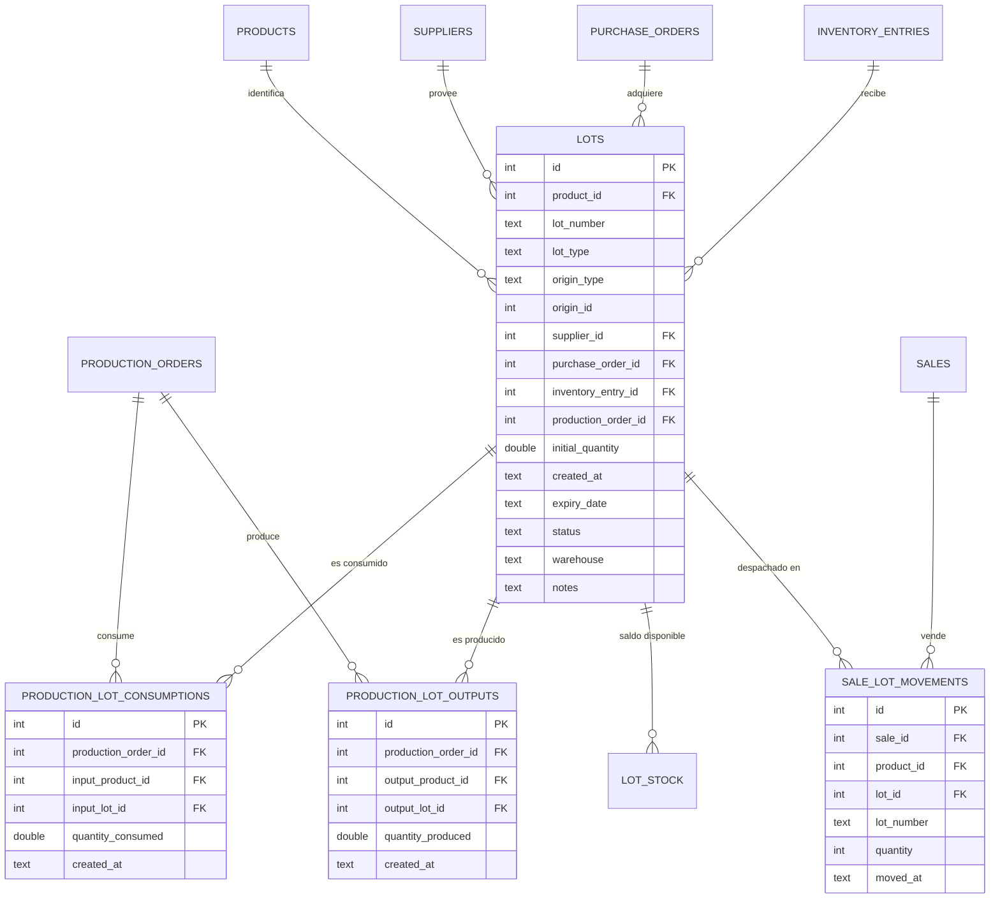

# Modelo Relacional de Genealogía de Lotes (Fase 5B)

**Fecha:** 15 de Septiembre de 2026  
**Sistema:** ERP Facturación & Gestión de Negocio  

---

## 1. Diagrama Entidad-Relación

---

## 2. Definición de Atributos Clave

1. **`lots`:**
   - `id`: Clave primaria sintética inmutable. Nunca cambia aunque el número comercial de lote se repita entre proveedores o temporadas.
   - `product_id`: Referencia obligatoria a `products(id) ON DELETE RESTRICT`.
   - `lot_type`: `'RAW_MATERIAL'`, `'SEMI_FINISHED'`, `'FINISHED_PRODUCT'`, `'SUPPLY'`, `'OTHER'`.
   - `origin_type`: `'PURCHASE'`, `'PRODUCTION'`, `'INITIAL_MIGRATION'`, `'ADJUSTMENT'`.
   - `status`: `'ACTIVE'`, `'DEPLETED'`, `'QUARANTINE'`, `'RECALLED'`, `'EXPIRED'`.
   - `initial_quantity`: Cantidad original ingresada al lote.
2. **`production_lot_consumptions`:**
   - Vincula cada orden de trabajo con el lote exacto de insumo consumido.
   - Inmutable: Registrado dentro de la misma transacción en que se descuenta el stock.
3. **`production_lot_outputs`:**
   - Vincula cada orden de trabajo con el lote de producto intermedio o terminado generado.
   - Permite la trazabilidad multinivel (`Materia Prima -> Subproducto -> Producto Final`).

---

## 3. Principio de Inmutabilidad

- Todas las llaves foráneas (`FK`) hacia `lots`, `products`, `suppliers`, `purchase_orders`, `production_orders` y `sales` están configuradas con `ON DELETE RESTRICT`.
- Está prohibido el borrado físico (`DELETE CASCADE`) de registros históricos de lotes o movimientos.
- Un lote agotado (`available_qty = 0`) pasa a estado inactivo pero conserva el 100% de su historia genealógica.
